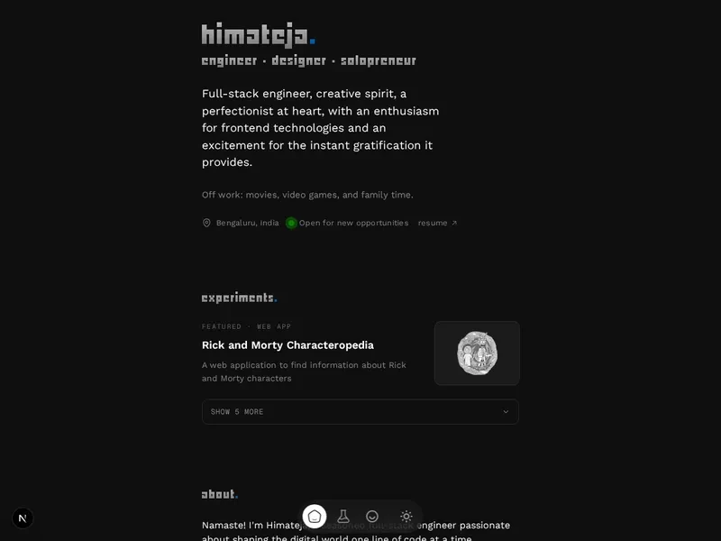

# himateja.com

[](LICENSE) [](LICENSE)

Source for [himateja.com](https://himateja.com): my portfolio, resume, and blog.



## Stack

Next.js 16 (App Router), React 19, TypeScript, Tailwind via CSS modules, Contentlayer for MDX posts. Runs on Bun. Hosted on Vercel.

## Run it

```bash
bun install
bun run dev        # http://localhost:3000
```

Other scripts: `bun run build`, `bun run lint`, `bun run typecheck`, `bun run format`.
